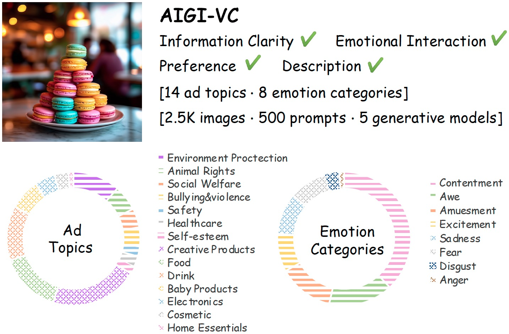
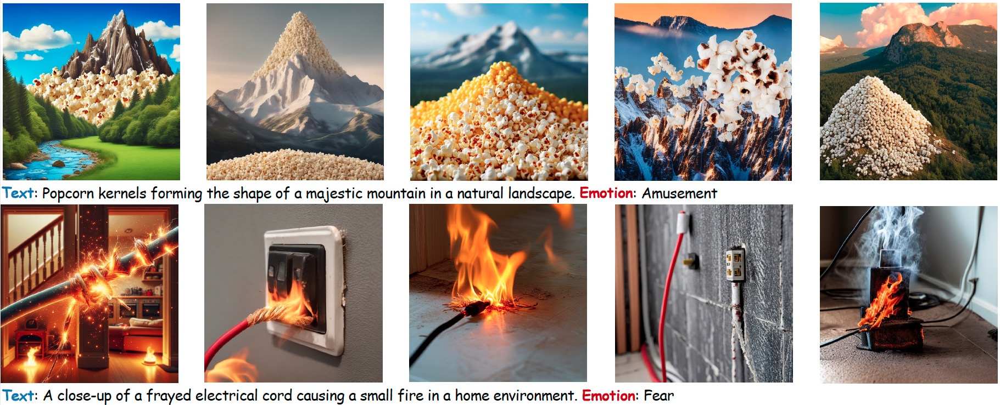

<h1 align="left">AIGI-VC</h1>
<h2 align="center">📄 <a href="https://example.com/paper" target="_blank">[Paper]</a> · 🎨 <a href="https://example.com/paper" target="_blank">[Dataset]</a></h2>
<h3 align="left">AI-generated Image Quality Assessment in Visual Communication</h3>

    

AIGI-VC database is a quality assessment database for AI-generated images in visual communication, which studies the communicability of AIGIs in the advertising field from the perspectives of information clarity and emotional interaction. The dataset consists of 2,500 images spanning 14 advertisement topics and 8 emotion types. It provides coarse-grained human preference annotations and fine-grained preference descriptions, benchmarking the abilities of IQA methods in preference prediction, interpretation, and reasoning.

 There are sample images from the AIGI-VC database.

    

🎉🎉🎉**The paper of AIGI-VC is accepted by AAAI 2025**!🎉🎉🎉

<h3 align="left">Citation</h3>

    If you're using AIGI-VC dataset in your research or applications, please cite using this BibTeX:

<pre><code>git clone https://github.com/your-repository.git
cd your-repository
git pull origin master</code></pre>
